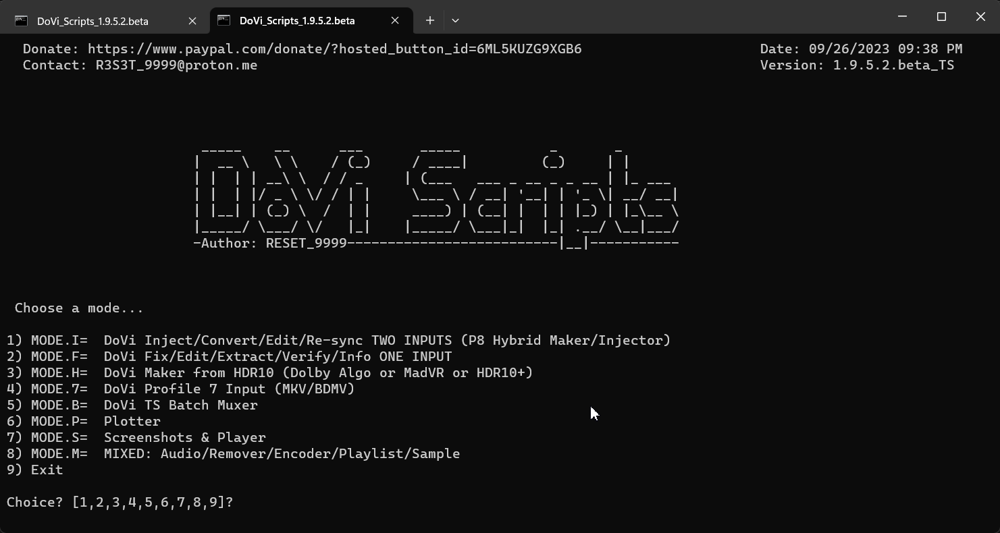

# DoVi_Scripts

Users-friendly scripts to work with HDR / Dolby Vision files and more...

link: https://drive.google.com/drive/u/1/folders/1keTxo5RoH8V_kqcZn4ZWF_J2M9DvOQRu
DONATE: https://www.paypal.com/donate/?hosted_button_id=6ML5KUZG9XGB6

Most of the tools needed: https://mega.nz/file/QLFT0QRY#x-pcsQJ9mE58PzFOveaF2ZLWYpTKRPeIRQUED_V-kwY

Put this DLL file somewhere reachable by avisynth+ (only needed if you want to use the dovi baker)
https://github.com/erazortt/DoViBaker/files/10810040/libdovi-3.1.1-x86_64-pc-windows-msvc.zip

install:
https://www.python.org/downloads/release/python-390/ (3.8 should work too)
https://avs-plus.net/ (64bit)
https://www.videohelp.com/software/LAV-Filters
https://www.videohelp.com/software/madVR

external settings/files example:
config file(L5 - MD)example for 3-1: https://drive.google.com/file/d/1cxGCIvP0qnhTzwIb_Up-BsQXrHGMwuM6/view?usp=drive_link 
Settings file example: https://drive.google.com/file/d/1u8Q_drQp2CdWpqZwHfdLuvHkPoVLcOf-/view?usp=drive_link

